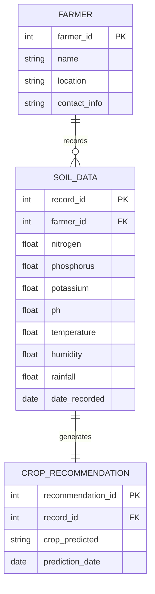

# Entity Relationship Diagram

## Description
- **FARMER**: Represents the user (farmer) interacting with the application.
- **SOIL_DATA**: Represents the environmental parameters (N, P, K, pH, temp, humidity, rainfall) provided by the farmer.
- **CROP_RECOMMENDATION**: Represents the ML model's output predicting the most suitable crop based on the soil data.
